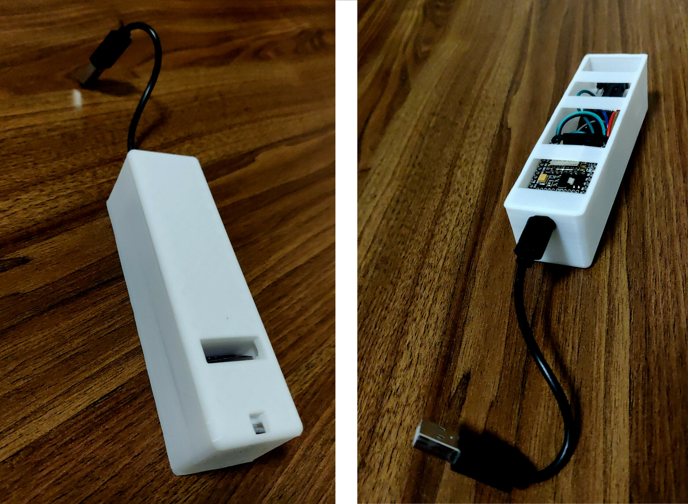
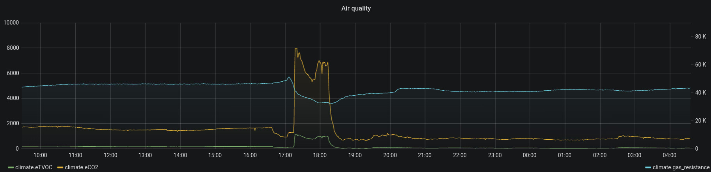

# nodemcu-envsensor

An ESP8266/nodemcu based CCS811 eCO2/eTVOC sensor plus BME680 temperature/humidity/air pressure sensor + case, for MQTT publication goodness. Disassembly-friendly.

# Submodules gotcha

This repo has submodules, notably [nodemcu-scaffold](https://github.com/skrewz/nodemcu-scaffold), and chained therefrom, [nodemcu-libs](https://github.com/skrewz/nodemcu-libs).

You should thus **clone with git's `--recursive` flag**.

# How does this work?

It's a case which (using Dupont cables and enough spacing) fits an ESP8266 [NodeMCU devkit v1.0](https://github.com/nodemcu/nodemcu-devkit-v1.0) together with a [CCS811](https://www.aliexpress.com/item/33058004405.html) and [BME680](https://www.aliexpress.com/item/32847670390.html) sensor breakout board.

Wiring-wise, the two sensors share an i2c bus. This unfortunately necessitates a bit of Dupont cable soldering to create a female-female-female cable. It strikes me as a firmware bug, but I cannot seem to set up two separate i2c busses—which I would otherwise have preferred; the soldering is actually the most time-consuming part of building a new one of these.

Firmware-wise, the thing connects to an MQTT broker, and publishes datapoints every minute for each sensor. I also implemented the CCS811 sensor's ability to receive temperature/humidity for its calibration purposes.

# What is it good for?

In my setup, these MQTT messages get picked up elsewhere and pumped into InfluxDB and thus allows me to render Grafana dashboards like these:

The spiking to eCO2 around ~8k (the max reading) happens every time the gas stove where I live is used—**ventilation is important**!

# Getting started

## Printing

The `.scad` is under the [openscad folder](openscad/). I've also put in [an STL file](openscad/envsensor_case.stl) for convenience.

It's meant to be printed in the orientation of the model. The strips across the bottom provide print bed adhesion as well as a platform for attaching this to a wall. Double-adhesive tape is a fairly permanent (and wallpaper-damaging!) way to do it, but mine generally hold up with just poster adhesive putty or similar.

## Building/uploading

It should be possible to simply run `make upload` and issue a `node.flashreload("lfs.img")` from within the serial console. Really, **the [nodemcu-scaffold project's README](https://github.com/skrewz/nodemcu-scaffold/blob/master/README.md) is the best place to start**—in fact, you'd be best off attempting an upload of that project first.

Of course, once this builds and uploads, it'll fail horribly at connecting to my MQTT setup, etc.

# Gotcha's

A couple of things I've picked up along the way:

- CO₂ is heavier than your average air. In a room with little circulation, this will matter a bit. To the extent aesthetics allow, measure at expected head height, like [the UK standards for schools](https://en.wikipedia.org/wiki/Indoor_air_quality#Carbon_dioxide).

- The CCS811's eCO2 and eTVOC readouts are apparently always proportional. I suspect the sensor comes up with the two "equivalent" numbers based on the same actual measurement. I tend to ignore eTVOC.

- The CCS811 in particular seems very sensitive to gusts of wind. Thus, the case might even be too open for its own good.

- The BME680 [supposedly supports a proprietary algorithm provided by Bosch's SDK](https://nodemcu.readthedocs.io/en/master/modules/bme680/) which would compute an IAQ index. I have little interest for proprietary algorithms, so I merely log the "gas resistance."

# See also

Credit to kstobbe's projects. Both the [CCS811 based one](http://kstobbe.dk/2019/01/28/first-sensor-array/) (which I pursued here) and the subsequent [build where that sensor is replaced by MICS6814](http://kstobbe.dk/2019/02/16/esp32-pms5003-bme280-mics6814-sensor-build/).

Next step for me would be to attempt using [this PM1.0+PM2.5+PM10 sensor](https://www.aliexpress.com/item/32813155485.html) in this same project. That'll require a redesign at some point.
